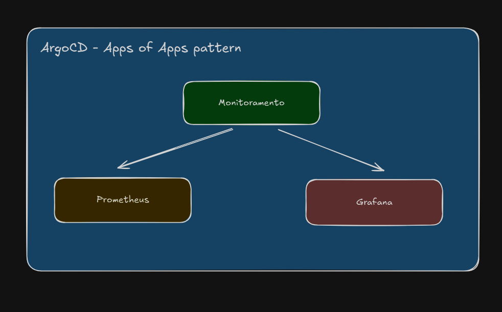
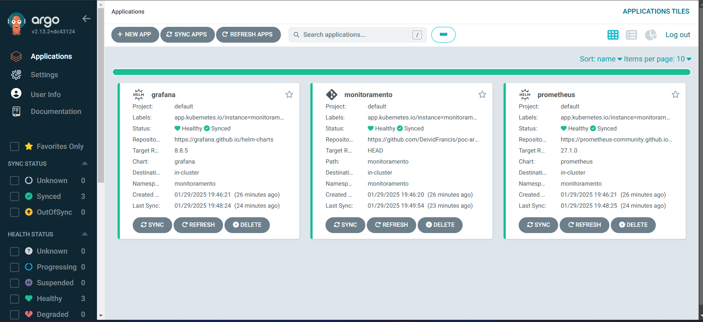
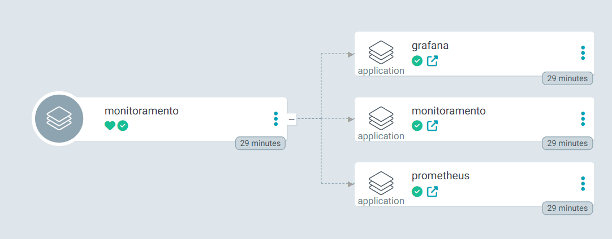

# PoC - ArgoCD Apps of Apps  

Este repositório demonstra o uso do **padrão Apps of Apps** no **ArgoCD**, permitindo o gerenciamento hierárquico de múltiplas aplicações dentro de um cluster Kubernetes.  

📺 **Referência em vídeo**:

[🔗 Padrões de Deploy com ArgoCD: App of Apps e ApplicationSet na Prática ~ Fabricio Veronez](https://www.youtube.com/live/rSVz3gzuF6g?si=bSFpjELhyPnSKItQ)  

### 🚀 Como Usar

**1️⃣ Fazer o Fork do Repositório**

**2️⃣ Substituir o repoURL pelo seu repositório**

Edite o arquivo `monitoramento/app-monitoramento.yaml` e substitua esta linha:

```yml
repoURL: https://github.com/DeividFrancis/poc-argocd-apps-of-apps.git
```
Por esta, usando o seu usuário do GitHub:
```yml
repoURL: https://github.com/SEU_USUARIO/poc-argocd-apps-of-apps.git
```
**3️⃣ Aplicar no Kubernetes**

Execute o comando abaixo para criar ou atualizar a aplicação no ArgoCD:
```sh
kubectl apply -f monitoramento/app-monitoramento.yaml
```

### Diagrama Arquitetural  
  
Representação da arquitetura **Apps of Apps**, onde uma aplicação raiz gerencia várias outras aplicações no ArgoCD.  

### Interface do ArgoCD  
  
Tela do **ArgoCD** mostrando o estado das aplicações gerenciadas dentro do cluster Kubernetes.  

### Monitoramento Tree  
  
Visualização hierárquica das aplicações no **ArgoCD**, exibindo dependências e status de cada componente.  

